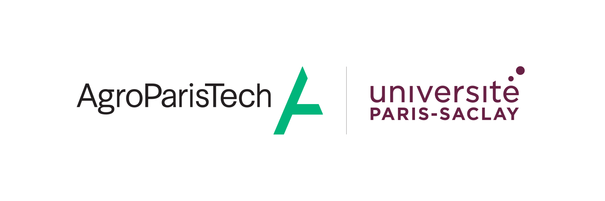

- 👋 Hi, I’m [ Timothée SANCHEZ ](https://www.linkedin.com/in/timothee-sanchez-ba1420267)
- 👀 I’m interested in Computer Science and Biology (Neurosciences == GOAT of biology) 
- 🌱 I'm currently in my last year of engineering school at [AgroParisTech](https://agroparistech.fr) in a cursus focusing on Data sciences and AI.
- ⚙️ I also like to work on side projects involving computer science, mainly on embedded devices (ESP-32).
- 📫 How to reach me : timothee.sanchez@agroparistech.fr 
- [My CV](Assets/CV_SANCHEZ_10-10.pdf)

<!---
Tikings/Tikings is a ✨ special ✨ repository because its `README.md` (this file) appears on your GitHub profile.
You can click the Preview link to take a look at your changes.
--->
